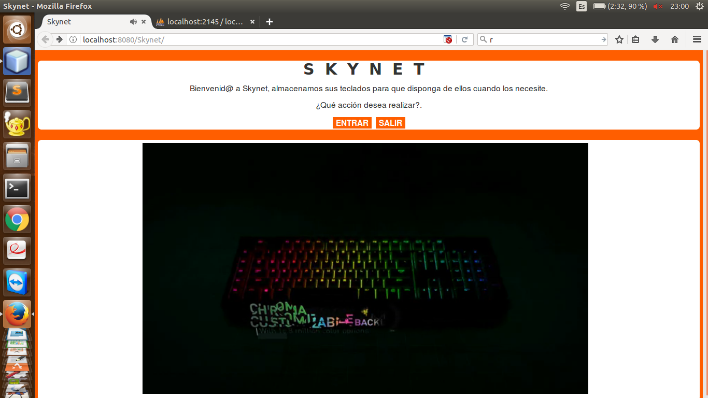
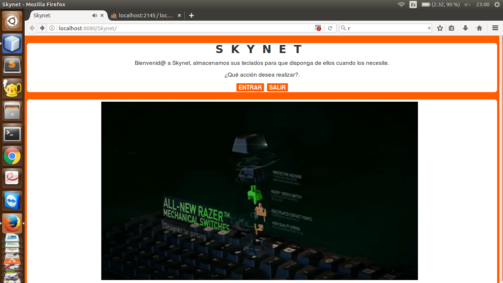
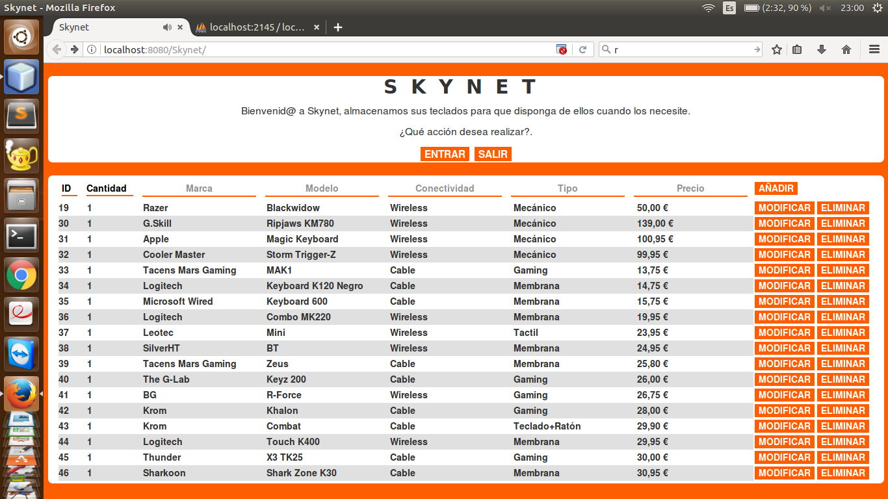
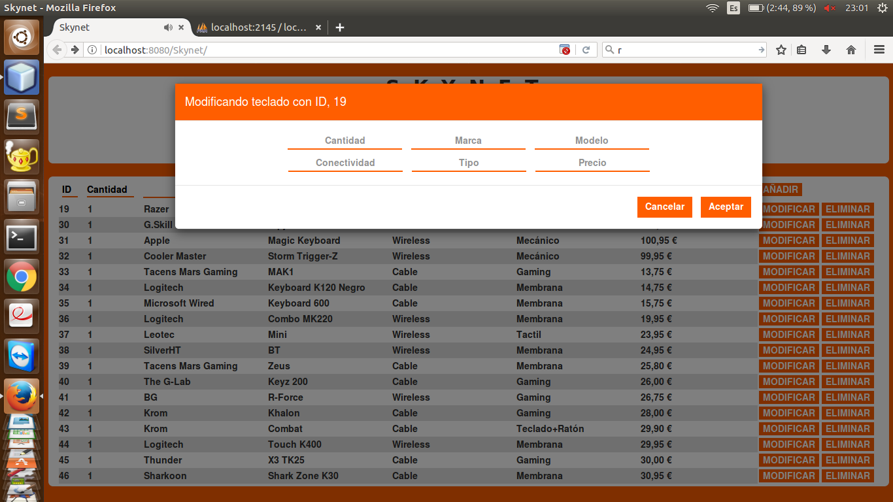

# CRUD-JSP
### Nombre de la aplicación: Skynet
### Descripción: CRUD Gestor de teclados.
### Para Este CRUD he usado Java, JQuery, AJAX y apenas nada de Bootstrap, el CSS ha sido desde 0.
## Index Captura 1.

## Index Captura 2.

## Apartado de gestión.

## Apartado de Modificación.

